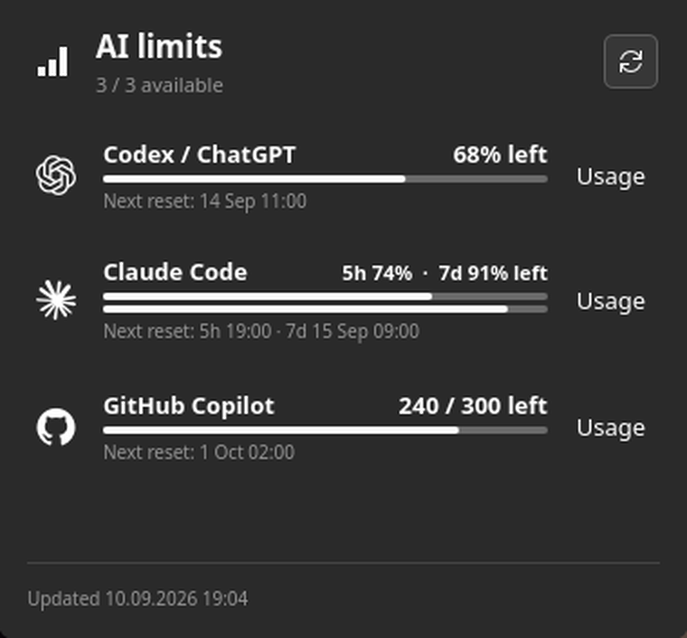

# AI Limits — KDE Plasma 6 widget

A small Plasma 6 panel widget for keeping Codex/ChatGPT, Claude Code, and
GitHub Copilot limits in one monochrome view. The panel representation is a
single compact summary (`C  — · A  — · G  —`); clicking it opens a popup with
one symbolic row per provider.

The widget uses the local sign-ins already used by the provider CLIs; it does
not scrape browser dashboards or read browser cookies. Codex, Claude, and
Copilot are all read automatically when their local CLI credentials are
available. Unknown values stay `—`; they are never shown as zero.



## Install

The only dependencies are the normal Plasma 6 runtime and Python 3. The
collector ships inside the widget package, so no separate executable has to be
on `PATH`.

From the KDE Store, install through **Edit Panel → Add Widgets → Get New
Widgets**, or install the downloaded archive directly:

```sh
kpackagetool6 --type Plasma/Applet --install ai-limits.plasmoid
```

From source, either install the package alone:

```sh
kpackagetool6 --type Plasma/Applet --install package
```

or use CMake, which additionally puts the collector and the optional Claude
status-line bridge on `PATH` for command-line use:

```sh
cmake -S . -B build -DCMAKE_INSTALL_PREFIX="$HOME/.local"
cmake --build build
cmake --install build
```

Add **AI Limits** to the panel using **Edit Panel → Add Widgets**, then drag it
next to the task manager. It is a Plasma panel widget rather than a task-manager
plugin, so it can also be placed on the desktop.

## Setup and automatic collection

After installation, the helper automatically tries:

- **Codex / ChatGPT:** the ChatGPT OAuth login in `~/.codex/auth.json` (or
  `$CODEX_HOME`). Sign in with the Codex CLI using your ChatGPT account.
- **GitHub Copilot:** `gh api copilot_internal/user`, reusing GitHub CLI's
  keychain-backed login. Run `gh auth login` if needed. This is the endpoint
  used by current Copilot clients, but GitHub does not document it as a public
  third-party API, so it may change.
- **Claude Code:** the OAuth login in `~/.claude/.credentials.json` (or
  `$CLAUDE_CONFIG_DIR`), read through the same usage endpoint Claude Code's own
  `/usage` command uses. Sign in with the Claude Code CLI. Nothing needs to be
  running: the widget shows **5h** and **7d** — plus per-model weekly windows on
  plans that have them — as of every refresh. Expired tokens are refreshed and
  written back the way the CLI does, so the login keeps working.

If the helper cannot read a Claude login, a status-line bridge can cache the
same windows instead:

```sh
limit-widget-setup claude
```

This backs up `~/.claude/settings.json`, wraps your existing status-line
command, and leaves credentials untouched. Values recovered this way are marked
stale and labelled with their age rather than being reset to zero.

If a CLI is not logged in, the popup gives a setup message instead of a fake
number. For a simple, credential-free snapshot, create
`~/.config/limit-widget/limits.json`:

```json
{
  "providers": {
    "codex": {
      "remaining": 12,
      "limit": 100,
      "resetAt": "2026-08-01T00:00:00Z",
      "detail": "Primary window"
    },
    "claude": {
      "remaining": 42,
      "limit": 100,
      "detail": "Five-hour window"
    },
    "copilot": {
      "remaining": 180,
      "limit": 300,
      "detail": "Premium requests"
    }
  }
}
```

For live values, use `~/.config/limit-widget/providers.json` to point at a
local command for each provider:

```json
{
  "providers": {
    "codex": { "command": ["/home/me/bin/codex-limit"] },
    "claude": { "command": ["/home/me/bin/claude-limit"] },
    "copilot": { "command": ["/home/me/bin/copilot-limit"] }
  }
}
```

Each command must print one JSON object to stdout, for example:

```json
{"remaining": 12, "limit": 100, "resetAt": "2026-08-01T00:00:00Z", "detail": "Primary window"}
```

Commands are executed without a shell, with an eight-second timeout, and only
their normalized result is sent to the widget. Keep credentials in the command
or a system secret store; do not put them in Plasma configuration or JSON files
that are world-readable. See `examples/` for copyable templates.

Refresh is five minutes by default and can be changed in the widget settings
from 1–60 minutes. Press **Refresh** in the popup for an immediate update.

## Provider limitations

- **Codex / ChatGPT:** the helper uses the same OAuth login and usage endpoint
  as the Codex CLI. OpenAI can change this client endpoint; if it stops
  working, sign in again or use a local adapter.
- **Claude Code:** the widget reads the five-hour and seven-day windows, and
  any per-model weekly windows, from the endpoint behind Claude Code's `/usage`.
  Anthropic can change this client endpoint; if it stops working, sign in again
  or use the status-line bridge.
- **GitHub Copilot:** the helper reads the current premium-interaction quota
  through the logged-in GitHub CLI. Account tiers may expose unlimited chat or
  completion quotas, which are displayed as unlimited rather than converted to
  a made-up total.

The popup links to each provider's official usage page. See
[`docs/provider-support.md`](docs/provider-support.md) for the support matrix
and endpoint details.

## Privacy

Collection is entirely local. The widget runs one Python collector on your own
machine and renders what it returns; there is no telemetry, no analytics, and
no server belonging to this project.

- Credentials are read from the locations the provider CLIs already use:
  `~/.codex/auth.json`, `~/.claude/.credentials.json`, and GitHub CLI's own
  credential store. They are never copied elsewhere, never written to Plasma
  configuration, and never exposed to QML — only normalized numbers reach the
  widget.
- When a Claude access token has expired, the collector refreshes it and writes
  the result back to `~/.claude/.credentials.json` exactly where the CLI expects
  it, with the file created `0600`.
- The only network requests are made directly to the providers, over HTTPS:
  `chatgpt.com` (Codex usage), `api.anthropic.com` and `platform.claude.com`
  (Claude usage and token refresh), and `api.github.com` via the `gh` CLI
  (Copilot quota). Requests carry your existing login and nothing else.
- If a provider is not signed in, its row shows a setup message. Unknown values
  stay `—` and are never shown as zero.

## KDE Store status

The widget package is self-contained and ready for Store upload; see
[`docs/kde-store.md`](docs/kde-store.md) for the release checklist and the
endpoint-stability disclosure that belongs in the listing.

## Development and tests

```sh
cmake -S . -B build -DBUILD_TESTING=ON
ctest --test-dir build --output-on-failure
```

The test suite uses sanitized temporary configuration and never contacts a
provider. Manual Plasma testing should cover both horizontal and vertical
panels, a missing helper, malformed JSON, and a command timeout.

To build the archive for Store upload:

```sh
./tools/make-store-archive.sh
```

## License

The widget code is MIT. Provider marks come from the user-supplied OpenAI
asset archive, Lobe Icons, and Primer Octicons; see
[`THIRD_PARTY_NOTICES.md`](THIRD_PARTY_NOTICES.md).
